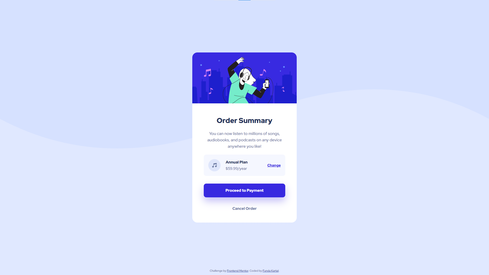

# Frontend Mentor - Stats Preview Card Component Solution

This is a solution to the [Order Summary Card Component Challenge on Frontend Mentor](https://www.frontendmentor.io/challenges/order-summary-component-QlPmajDUj).

## Table of contents

- [Overview](#overview)
  - [The challenge](#the-challenge)
  - [Screenshot](#screenshot)
  - [Links](#links)
- [My process](#my-process)
  - [Built with](#built-with)
  - [What I learned](#what-i-learned)
  - [Useful resources](#useful-resources)

## Overview

### The challenge

Users should be able to:

- See hover states for interactive elements

### Screenshot



### Links

- Solution URL: [https://www.frontendmentor.io/solutions/order-summary-card-component-using-scss-coTG38YTE](https://www.frontendmentor.io/solutions/order-summary-card-component-using-scss-coTG38YTE)
- Live Site URL: [https://fundakartal.github.io/order-summary-component/](https://fundakartal.github.io/order-summary-component/)

## My process

### Built with

- Semantic HTML5 markup
- SCSS custom properties
- CSS Flexbox

### What I learned

By resetting the root (HTML) font size to 62.5%; I calculated all of my REM units with that magical 1rem = 10px formula.

```css

html {
  font-size: 62.5%;
}

```

### Useful resources

- [font-size @ MDN Web Docs](https://developer.mozilla.org/en-US/docs/Web/CSS/font-size)

## Author

- Frontend Mentor - [@fundakartal](https://www.frontendmentor.io/profile/fundakartal)
- Twitter - [@fundakartal](https://twitter.com/fundakartaI)